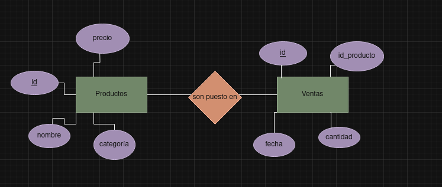

# Tarea 4

## Paso 1:

Creamos las tablas dentro del fichero supermercado-dump.sql.

```sql

CREATE TABLE productos (
    id INTEGER PRIMARY KEY,
    nombre TEXT,
    categoria TEXT,
    precio REAL
);

+----+--------------------+-----------+--------+
| id |       nombre       | categoria | precio |
+----+--------------------+-----------+--------+
| 1  | Arroz              | Alimentos | 2.5    |
| 2  | Leche              | Lácteos   | 1.8    |
| 3  | Pan                | Panadería | 1.2    |
| 4  | Manzanas           | Frutas    | 3.0    |
| 5  | Pollo              | Carnes    | 5.5    |
| 6  | Huevos             | Lácteos   | 1.0    |
| 7  | Yogurt             | Lácteos   | 2.0    |
| 8  | Tomates            | Verduras  | 2.2    |
| 9  | Queso              | Lácteos   | 4.0    |
| 10 | Cereal             | Desayuno  | 3.5    |
| 11 | Papel Higiénico    | Hogar     | 1.5    |
| 12 | Cepillo de Dientes | Higiene   | 2.0    |
| 13 | Detergente         | Limpieza  | 2.8    |
| 14 | Galletas           | Snacks    | 1.7    |
| 15 | Aceite de Oliva    | Cocina    | 4.5    |
| 16 | Café               | Bebidas   | 5.0    |
| 17 | Sopa enlatada      | Conservas | 2.3    |
| 18 | Jabón de Baño      | Higiene   | 1.2    |
| 19 | Botellas de Agua   | Bebidas   | 1.0    |
| 20 | Cerveza            | Bebidas   | 3.8    |
+----+--------------------+-----------+--------+
```


```sql
CREATE TABLE ventas (
    id INTEGER PRIMARY KEY,
    id_producto INTEGER,
    cantidad INTEGER,
    fecha DATE,
    FOREIGN KEY (id_producto) REFERENCES productos(id)
);

+----+-------------+----------+------------+
| id | id_producto | cantidad |   fecha    |
+----+-------------+----------+------------+
| 1  | 1           | 5        | 2024-01-17 |
| 2  | 2           | 3        | 2024-01-17 |
| 3  | 4           | 2        | 2024-01-17 |
| 4  | 5           | 1        | 2024-01-17 |
| 5  | 6           | 10       | 2024-01-18 |
| 6  | 8           | 4        | 2024-01-18 |
| 7  | 10          | 2        | 2024-01-18 |
| 8  | 14          | 7        | 2024-01-19 |
| 9  | 16          | 3        | 2024-01-19 |
| 10 | 18          | 6        | 2024-01-20 |
+----+-------------+----------+------------+
```

## Paso 2: Lectura del fichero SQL.

Creamos el fichero tarea2.db con:

```sql
sqlite3 tarea4.db
```
Y luego colocamos el comando .read para insertar la información del fichero supermercado-db.sql

```sql
.read supermercado-dump.sql
```

## Paso 3: Responde a las siguientes cuestiones

### ER



## Paso 4: Responde a las siguientes cuestiones


### Mostrar todos los productos de la categoría "Bebidas".
```sql
SELECT * FROM productos WHERE categoria LIKE 'Bebidas';

+----+------------------+-----------+--------+
| id |      nombre      | categoria | precio |
+----+------------------+-----------+--------+
| 16 | Café             | Bebidas   | 5.0    |
| 19 | Botellas de Agua | Bebidas   | 1.0    |
| 20 | Cerveza          | Bebidas   | 3.8    |
+----+------------------+-----------+--------+
```
### Listar los productos ordenados por precio de forma descendente.

```sql
SELECT * FROM productos order by precio desc;

+----+--------------------+-----------+--------+
| id |       nombre       | categoria | precio |
+----+--------------------+-----------+--------+
| 5  | Pollo              | Carnes    | 5.5    |
| 16 | Café               | Bebidas   | 5.0    |
| 15 | Aceite de Oliva    | Cocina    | 4.5    |
| 9  | Queso              | Lácteos   | 4.0    |
| 20 | Cerveza            | Bebidas   | 3.8    |
| 10 | Cereal             | Desayuno  | 3.5    |
| 4  | Manzanas           | Frutas    | 3.0    |
| 13 | Detergente         | Limpieza  | 2.8    |
| 1  | Arroz              | Alimentos | 2.5    |
| 17 | Sopa enlatada      | Conservas | 2.3    |
| 8  | Tomates            | Verduras  | 2.2    |
| 7  | Yogurt             | Lácteos   | 2.0    |
| 12 | Cepillo de Dientes | Higiene   | 2.0    |
| 2  | Leche              | Lácteos   | 1.8    |
| 14 | Galletas           | Snacks    | 1.7    |
| 11 | Papel Higiénico    | Hogar     | 1.5    |
| 3  | Pan                | Panadería | 1.2    |
| 18 | Jabón de Baño      | Higiene   | 1.2    |
| 6  | Huevos             | Lácteos   | 1.0    |
| 19 | Botellas de Agua   | Bebidas   | 1.0    |
+----+--------------------+-----------+--------+
```

### Calcular el precio total de todos los productos en la tabla "productos".

```sql
SELECT SUM(precio) AS suma_precios FROM productos;

+--------------+
| suma_precios |
+--------------+
| 52.5         |
+--------------+
```
### Encontrar los productos con un nombre que contenga la letra 'a'.

```sql
SELECT * FROM productos WHERE(nombre like '%a%');

+----+------------------+-----------+--------+
| id |      nombre      | categoria | precio |
+----+------------------+-----------+--------+
| 1  | Arroz            | Alimentos | 2.5    |
| 3  | Pan              | Panadería | 1.2    |
| 4  | Manzanas         | Frutas    | 3.0    |
| 8  | Tomates          | Verduras  | 2.2    |
| 10 | Cereal           | Desayuno  | 3.5    |
| 11 | Papel Higiénico  | Hogar     | 1.5    |
| 14 | Galletas         | Snacks    | 1.7    |
| 15 | Aceite de Oliva  | Cocina    | 4.5    |
| 16 | Café             | Bebidas   | 5.0    |
| 17 | Sopa enlatada    | Conservas | 2.3    |
| 18 | Jabón de Baño    | Higiene   | 1.2    |
| 19 | Botellas de Agua | Bebidas   | 1.0    |
| 20 | Cerveza          | Bebidas   | 3.8    |
+----+------------------+-----------+--------+
```

### Obtener la cantidad total de productos vendidos en todas las fechas.

```sql
SELECT SUM(cantidad) as vendidos_total FROM ventas;

+----------------+
| vendidos_total |
+----------------+
| 43             |
+----------------+
```

### Encontrar el producto más caro en cada categoría.

```sql
SELECT nombre,MAX(precio) FROM productos GROUP BY categoria;

+--------------------+-------------+
|       nombre       | MAX(precio) |
+--------------------+-------------+
| Arroz              | 2.5         |
| Café               | 5.0         |
| Pollo              | 5.5         |
| Aceite de Oliva    | 4.5         |
| Sopa enlatada      | 2.3         |
| Cereal             | 3.5         |
| Manzanas           | 3.0         |
| Cepillo de Dientes | 2.0         |
| Papel Higiénico    | 1.5         |
| Detergente         | 2.8         |
| Queso              | 4.0         |
| Pan                | 1.2         |
| Galletas           | 1.7         |
| Tomates            | 2.2         |
+--------------------+-------------+
```

### Listar los productos que no han sido vendidos.
```sql
SELECT * FROM productos where id not in (SELECT p.id from productos as p, ventas as v where p.id = v.id_producto);

+----+--------------------+-----------+--------+
| id |       nombre       | categoria | precio |
+----+--------------------+-----------+--------+
| 3  | Pan                | Panadería | 1.2    |
| 7  | Yogurt             | Lácteos   | 2.0    |
| 9  | Queso              | Lácteos   | 4.0    |
| 11 | Papel Higiénico    | Hogar     | 1.5    |
| 12 | Cepillo de Dientes | Higiene   | 2.0    |
| 13 | Detergente         | Limpieza  | 2.8    |
| 15 | Aceite de Oliva    | Cocina    | 4.5    |
| 17 | Sopa enlatada      | Conservas | 2.3    |
| 19 | Botellas de Agua   | Bebidas   | 1.0    |
| 20 | Cerveza            | Bebidas   | 3.8    |
+----+--------------------+-----------+--------+
```
### Calcular el precio promedio de los productos en la categoría "Snacks".
```sql
SELECT AVG(precio) from productos where categoria like 'Snacks';

+-------------+
| AVG(precio) |
+-------------+
| 1.7         |
+-------------+
```
### Encontrar los productos que han sido vendidos más de 5 veces.
```sql
SELECT id_producto,cantidad FROM ventas WHERE cantidad >= 5;

+-------------+----------+
| id_producto | cantidad |
+-------------+----------+
| 1           | 5        |
| 6           | 10       |
| 14          | 7        |
| 18          | 6        |
+-------------+----------+
```

### Mostrar la fecha y la cantidad de ventas para cada producto.

```sql
SELECT p.id, p.nombre, v.fecha, v.cantidad FROM productos as p, ventas as v WHERE p.id=v.id_producto;

+----+---------------+------------+----------+
| id |    nombre     |   fecha    | cantidad |
+----+---------------+------------+----------+
| 1  | Arroz         | 2024-01-17 | 5        |
| 2  | Leche         | 2024-01-17 | 3        |
| 4  | Manzanas      | 2024-01-17 | 2        |
| 5  | Pollo         | 2024-01-17 | 1        |
| 6  | Huevos        | 2024-01-18 | 10       |
| 8  | Tomates       | 2024-01-18 | 4        |
| 10 | Cereal        | 2024-01-18 | 2        |
| 14 | Galletas      | 2024-01-19 | 7        |
| 16 | Café          | 2024-01-19 | 3        |
| 18 | Jabón de Baño | 2024-01-20 | 6        |
+----+---------------+------------+----------+
```
### Encontrar los productos que tienen un precio menor o igual a 2.

```sql
SELECT nombre, precio FROM productos WHERE precio <= 2;

+--------------------+--------+
|       nombre       | precio |
+--------------------+--------+
| Leche              | 1.8    |
| Pan                | 1.2    |
| Huevos             | 1.0    |
| Yogurt             | 2.0    |
| Papel Higiénico    | 1.5    |
| Cepillo de Dientes | 2.0    |
| Galletas           | 1.7    |
| Jabón de Baño      | 1.2    |
| Botellas de Agua   | 1.0    |
+--------------------+--------+
```

### Calcular la cantidad total de ventas para cada fecha.

```sql
SELECT fecha, SUM(cantidad) AS totalventas
FROM ventas
GROUP BY fecha;

+------------+-------------+
|   fecha    | totalventas |
+------------+-------------+
| 2024-01-17 | 11          |
| 2024-01-18 | 16          |
| 2024-01-19 | 10          |
| 2024-01-20 | 6           |
+------------+-------------+
```
### Listar los productos cuyo nombre comienza con la letra 'P'.

```sql
SELECT nombre FROM productos WHERE (nombre like 'P%');

+-----------------+
|     nombre      |
+-----------------+
| Pan             |
| Pollo           |
| Papel Higiénico |
+-----------------+
```

### Obtener el producto más vendido en términos de cantidad.

```sql
SELECT p.nombre,MAX(v.cantidad) FROM ventas as v, productos as p;

+--------+-----------------+
| nombre | MAX(v.cantidad) |
+--------+-----------------+
| Arroz  | 10              |
+--------+-----------------+
```
### Mostrar los productos que fueron vendidos en la fecha '2024-01-18'.

```sql
SELECT productos.nombre, productos.precio, ventas.fecha FROM ventas JOIN productos ON ventas.id_producto = productos.id WHERE ventas.fecha = '2024-01-18';

+---------+--------+------------+
| nombre  | precio |   fecha    |
+---------+--------+------------+
| Huevos  | 1.0    | 2024-01-18 |
| Tomates | 2.2    | 2024-01-18 |
| Cereal  | 3.5    | 2024-01-18 |
+---------+--------+------------+
```

### Calcular el total de ventas para cada producto.


### Encontrar los productos con un precio entre 3 y 4.

```sql
SELECT nombre, precio FROM productos WHERE precio BETWEEN 3 AND 4;
+----------+--------+
|  nombre  | precio |
+----------+--------+
| Manzanas | 3.0    |
| Queso    | 4.0    |
| Cereal   | 3.5    |
| Cerveza  | 3.8    |
+----------+--------+
```

### Listar los productos y sus categorías ordenados alfabéticamente por categoría.

```sql
SELECT nombre, categoria FROM productos ORDER BY categoria ASC;
+--------------------+-----------+
|       nombre       | categoria |
+--------------------+-----------+
| Arroz              | Alimentos |
| Café               | Bebidas   |
| Botellas de Agua   | Bebidas   |
| Cerveza            | Bebidas   |
| Pollo              | Carnes    |
| Aceite de Oliva    | Cocina    |
| Sopa enlatada      | Conservas |
| Cereal             | Desayuno  |
| Manzanas           | Frutas    |
| Cepillo de Dientes | Higiene   |
| Jabón de Baño      | Higiene   |
| Papel Higiénico    | Hogar     |
| Detergente         | Limpieza  |
| Leche              | Lácteos   |
| Huevos             | Lácteos   |
| Yogurt             | Lácteos   |
| Queso              | Lácteos   |
| Pan                | Panadería |
| Galletas           | Snacks    |
| Tomates            | Verduras  |
+--------------------+-----------+
```

### Calcular el precio total de los productos vendidos en la fecha '2024-01-19'.

```sql
SELECT SUM(p.precio * v.cantidad) AS 'Ingresos del día 2024-01-19' from productos AS p, ventas AS v WHERE v.fecha = '2024-01-19'and p.id=v.id_producto;
+-----------------------------+
| Ingresos del día 2024-01-19 |
+-----------------------------+
| 26.9                        |
+-----------------------------+
```

### Mostrar los productos que no pertenecen a la categoría "Higiene".

```sql
SELECT * FROM productos
WHERE LOWER(categoria) != LOWER('Higiene');
+----+------------------+-----------+--------+
| id |      nombre      | categoria | precio |
+----+------------------+-----------+--------+
| 1  | Arroz            | Alimentos | 2.5    |
| 2  | Leche            | Lácteos   | 1.8    |
| 3  | Pan              | Panadería | 1.2    |
| 4  | Manzanas         | Frutas    | 3.0    |
| 5  | Pollo            | Carnes    | 5.5    |
| 6  | Huevos           | Lácteos   | 1.0    |
| 7  | Yogurt           | Lácteos   | 2.0    |
| 8  | Tomates          | Verduras  | 2.2    |
| 9  | Queso            | Lácteos   | 4.0    |
| 10 | Cereal           | Desayuno  | 3.5    |
| 11 | Papel Higiénico  | Hogar     | 1.5    |
| 13 | Detergente       | Limpieza  | 2.8    |
| 14 | Galletas         | Snacks    | 1.7    |
| 15 | Aceite de Oliva  | Cocina    | 4.5    |
| 16 | Café             | Bebidas   | 5.0    |
| 17 | Sopa enlatada    | Conservas | 2.3    |
| 19 | Botellas de Agua | Bebidas   | 1.0    |
| 20 | Cerveza          | Bebidas   | 3.8    |
+----+------------------+-----------+--------+
```

### Encontrar la cantidad total de productos en cada categoría.

```sql
SELECT categoria, COUNT(*) as Total
FROM productos
GROUP BY categoria;
+-----------+-------+
| categoria | Total |
+-----------+-------+
| Alimentos | 1     |
| Bebidas   | 3     |
| Carnes    | 1     |
| Cocina    | 1     |
| Conservas | 1     |
| Desayuno  | 1     |
| Frutas    | 1     |
| Higiene   | 2     |
| Hogar     | 1     |
| Limpieza  | 1     |
| Lácteos   | 4     |
| Panadería | 1     |
| Snacks    | 1     |
| Verduras  | 1     |
+-----------+-------+
```

### Listar los productos que tienen un precio igual a la media de precios.

```sql
SELECT ventas.fecha, SUM(productos.precio * ventas.cantidad) AS total FROM ventas JOIN Productos ON ventas.id_producto = productos.id GROUP BY Ventas.Fecha;
+------------+-------+
|   fecha    | total |
+------------+-------+
| 2024-01-17 | 29.4  |
| 2024-01-18 | 25.8  |
| 2024-01-19 | 26.9  |
| 2024-01-20 | 7.2   |
+------------+-------+
```

### Calcular el precio total de los productos vendidos en cada fecha.

```sql
SELECT ventas.fecha, SUM(productos.precio * ventas.cantidad) AS total FROM ventas JOIN Productos ON ventas.id_producto = productos.id GROUP BY Ventas.Fecha;
+------------+-------+
|   fecha    | total |
+------------+-------+
| 2024-01-17 | 29.4  |
| 2024-01-18 | 25.8  |
| 2024-01-19 | 26.9  |
| 2024-01-20 | 7.2   |
+------------+-------+

```

### Mostrar los productos con un nombre que termina con la letra 'o'.

```sql
SELECT * FROM productos WHERE nombre LIKE '%o';
+----+-----------------+-----------+--------+
| id |     nombre      | categoria | precio |
+----+-----------------+-----------+--------+
| 5  | Pollo           | Carnes    | 5.5    |
| 9  | Queso           | Lácteos   | 4.0    |
| 11 | Papel Higiénico | Hogar     | 1.5    |
| 18 | Jabón de Baño   | Higiene   | 1.2    |
+----+-----------------+-----------+--------+
```

### Encontrar los productos que han sido vendidos en más de una fecha.


### Listar los productos cuya categoría comienza con la letra 'L'.
```sql
SELECT * FROM Productos WHERE Categoria LIKE 'L%';
+----+------------+-----------+--------+
| id |   nombre   | categoria | precio |
+----+------------+-----------+--------+
| 2  | Leche      | Lácteos   | 1.8    |
| 6  | Huevos     | Lácteos   | 1.0    |
| 7  | Yogurt     | Lácteos   | 2.0    |
| 9  | Queso      | Lácteos   | 4.0    |
| 13 | Detergente | Limpieza  | 2.8    |
+----+------------+-----------+--------+
```

### Calcular el total de ventas para cada producto en la fecha '2024-01-17'.

### Mostrar los productos cuyo nombre tiene al menos 5 caracteres.

```sql
SELECT * FROM Productos WHERE LENGTH(Nombre) >= 5;
+----+--------------------+-----------+--------+
| id |       nombre       | categoria | precio |
+----+--------------------+-----------+--------+
| 1  | Arroz              | Alimentos | 2.5    |
| 2  | Leche              | Lácteos   | 1.8    |
| 4  | Manzanas           | Frutas    | 3.0    |
| 5  | Pollo              | Carnes    | 5.5    |
| 6  | Huevos             | Lácteos   | 1.0    |
| 7  | Yogurt             | Lácteos   | 2.0    |
| 8  | Tomates            | Verduras  | 2.2    |
| 9  | Queso              | Lácteos   | 4.0    |
| 10 | Cereal             | Desayuno  | 3.5    |
| 11 | Papel Higiénico    | Hogar     | 1.5    |
| 12 | Cepillo de Dientes | Higiene   | 2.0    |
| 13 | Detergente         | Limpieza  | 2.8    |
| 14 | Galletas           | Snacks    | 1.7    |
| 15 | Aceite de Oliva    | Cocina    | 4.5    |
| 17 | Sopa enlatada      | Conservas | 2.3    |
| 18 | Jabón de Baño      | Higiene   | 1.2    |
| 19 | Botellas de Agua   | Bebidas   | 1.0    |
| 20 | Cerveza            | Bebidas   | 3.8    |
+----+--------------------+-----------+--------+
```

### Encontrar los productos que tienen un precio superior al precio máximo en la tabla "productos".

